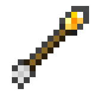

# Torch Arrows Mod

Torch Arrows allow a player to use a bow to place torches from a distance.  Used similarly to tipped and spectral arrows, by placing a Torch Arrow in the offhand slot.

## Crafting

<% recipe({
	slot2: 'coal',
	slot5: 'stick',
	slot8: 'feather',
	result: 'torch-arrow'
}) %>

## Combat

Torch Arrows do less damage than normal arrows (exact number is being calculated).  An idea under consideration would give torch arrows a random chance to set an attacked entity on fire.

## Media

screen shots

youtube link

## Issues

Issues relating to Torch Arrows are maintained on [GitHub](https://github.com/ToroCraft/TorchArrows).  [Report an Issue](https://github.com/ToroCraft/TorchArrows/issues/new)